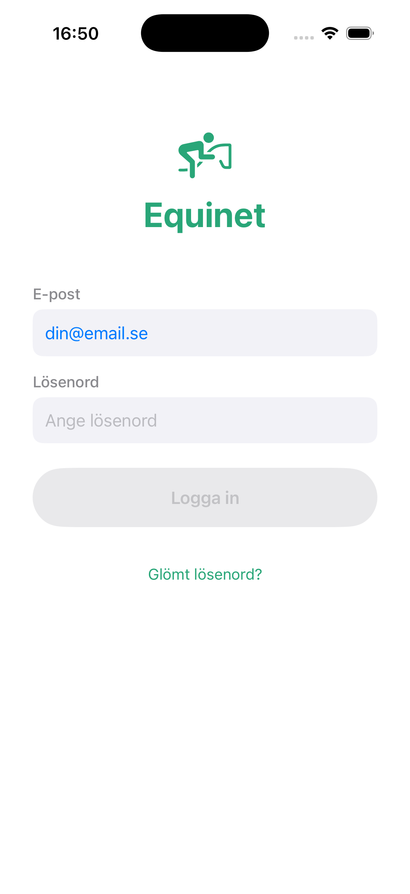
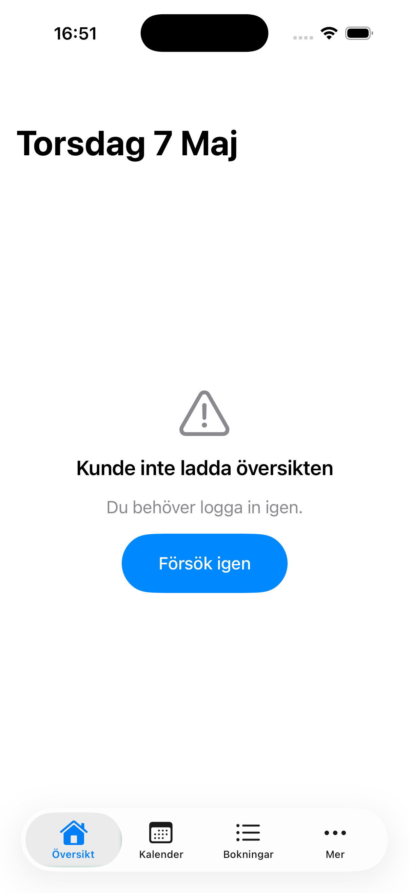

# iOS Staging Demo Verification (2026-05-07)

> **Read-only verifiering.** Inga kod-, env-, eller deploy-ändringar. Endast bygge + visuell observation i simulator.

---

## Sammanfattning

PR #327 ändrade iOS `AppConfig.staging.baseURL` till `https://equinet-staging.johanlindengard.com` och separerade prod-Supabase. Verifiering i simulator bekräftar:

- ✅ **Native login fungerar** — `NativeLoginView` renderas, Supabase Swift SDK auth mot staging-projekt (`zzdamokfeenencuggjjp`) lyckas med Erik:s konto
- ✅ **AppConfig pekar på rätt staging-Supabase** — Erik:s seed-data (skapad 2026-05-07 mot staging) accepterar login-creds
- ❌ **Alla native API-anrop blockeras av Vercel SSO** — `/api/native/dashboard`, `/api/native/calendar`, `/api/native/services`, även **`/api/feature-flags`** (publik no-auth) returnerar **HTTP 401** med `_vercel_sso_nonce`-cookie
- ❌ **Dashboard tom** — UI visar "Kunde inte ladda översikten. Du behöver logga in igen." trots att Supabase-session är giltig
- ❌ **WebView-sidor (Mer-flik) skulle få samma 401** — inte testat men strukturellt samma som API-anropen

**Huvudfynd:** Vercel SSO sitter som ett lager **före** app-koden. Alla HTTP-anrop till `equinet-staging.johanlindengard.com` returnerar 401 oavsett om de är publika eller autentiserade i app-logiken. Native auth via Supabase Swift SDK kringgår detta (anropar Supabase-projektet direkt, inte via Vercel) — men resten av appen är beroende av Vercel-API:t.

---

## 1. Setup

| Komponent | Värde |
|---|---|
| Simulator | iPhone 17 Pro, iOS 26.3 (UDID `4175ABB8-784F-46DE-A10B-CACF782DF89D`) |
| iOS scheme | `Equinet` (Debug-config) |
| Build | `xcodebuild build` med `-derivedDataPath /tmp/equinet-derived` → BUILD SUCCEEDED |
| Launch args | `-STAGING --debug-autologin --debug-email erik.jarnfot@demo.equinet.se --debug-password DemoProvider123!` |
| Bas-commit | `6cb86745` (staging-branch efter PR #327) |
| Staging-deployment | `READY` — sha `6cb8674`, URL `equinet-1rw8w7dft-cola500s-projects.vercel.app` |
| Custom domain | `equinet-staging.johanlindengard.com` (HTTP 401 på alla paths) |

Mobile-MCP (WebDriverAgent) timeout:ade vid screenshot — fall-back till `xcrun simctl io ... screenshot` som fungerade direkt.

---

## 2. Vad fungerade

### Native login-skärm renderas korrekt



- Svenska strängar: "E-post", "Lösenord", "Logga in", "Glömt lösenord?"
- Ingen WebView-fallback — `NativeLoginView` (SwiftUI) körs
- Form-fälten är native — inte WebView-element

Detta bekräftar att appen kör i `-STAGING`-läge. Om den hade pekat på `localhost:3000` (default i Debug) skulle den fortfarande visa native login (det är samma UI), men:

### Native Supabase auth lyckas mot staging

Efter `--debug-autologin` med Erik:s creds:
- `AuthManager.login()` anropade `SupabaseManager.client.auth.signIn()` mot `https://zzdamokfeenencuggjjp.supabase.co`
- Login lyckades — appen kommer förbi login-skärmen
- TabView med Översikt/Kalender/Bokningar/Mer renderas

**Detta bevisar:**
1. iOS pekar på rätt staging-Supabase (`zzdamokfeenencuggjjp`) — om den hade pekat på prod (`xybyzflfxnqqyxnvjklv`) skulle Erik:s konto inte finnas där
2. Custom domain-bytet i webb-baseURL påverkade inte Supabase-direktanrop (de går utanför Vercel)

---

## 3. Vad failade

### Dashboard renderar fel-tillstånd



- Rubrik: "Torsdag 7 Maj" (datum-formatering korrekt, native-renderat)
- Felmeddelande: "Kunde inte ladda översikten. Du behöver logga in igen."
- "Försök igen"-knapp tillgänglig
- TabView-tabs synliga (alla skulle få samma fel om de tappades)

### Misslyckande-källa: Vercel SSO 401

`DashboardViewModel.fetchDashboard()` anropade `APIClient.fetchDashboard()` med `Authorization: Bearer <Supabase JWT>` mot `https://equinet-staging.johanlindengard.com/api/native/dashboard`. Vercel returnerade **401** innan request:en nådde Next.js-app-koden.

`APIClient.swift:652-660`-logiken:
- 401 → försök refresh:a Supabase-session, retry once
- Refresh:en lyckas (Supabase är OK)
- Retry mot samma URL → fortfarande 401 (Vercel SSO oförändrad)
- Throw `APIError.unauthorized`
- ViewModel visar "logga in igen"-meddelande

**Inget av detta är ett bug i app-koden** — det är förväntat per `ios-demo-parity-audit.md` Risk 6.3.

---

## 4. Empirisk verifiering av SSO-blocker

Direkt curl mot staging custom domain bekräftar att **alla** endpoints returnerar 401, även de som är publika no-auth i app-logiken:

```
HTTP 401  /api/native/dashboard
HTTP 401  /api/native/calendar
HTTP 401  /api/native/services
HTTP 401  /api/feature-flags  ← publik no-auth i Next.js, fortfarande 401 från Vercel
```

Response-headers:
```
content-type: text/html; charset=utf-8
set-cookie: _vercel_sso_nonce=...; Max-Age=3600; Path=/; Secure; HttpOnly
x-vercel-id: iad1::...
```

`_vercel_sso_nonce`-cookien är beviset att SSO-utmaningen presenteras. Det är inte en NextResponse från Next.js — det är Vercel-platforms-respons.

### Bypass-cookien `_vercel_jwt` (från Share Link) skulle hjälpa men...

Tidigare i sessionen aktiverade vi en Vercel Share Link som ger `_vercel_jwt`-cookie giltig 7 dagar för `equinet-staging.johanlindengard.com`. Den **fungerar för WebView-flöde** men:

- iOS APIClient skickar bara `Authorization: Bearer ...`, ingen `Cookie:`-header
- Även om WebView råkar ha cookie:n, så delar **iOS APIClient** och **WKWebView** olika `URLSession`-cookie-jars
- Bypass-cookien hjälper alltså inte native API-anrop strukturellt

Detta matchar audit-fyndet 6.6 ("Native API auth kan inte använda Vercel bypass-cookie").

---

## 5. Konsekvenser

| Aspekt | Status idag |
|---|---|
| iOS staging native login | ✅ Fungerar (Supabase Swift SDK direkt) |
| iOS staging dashboard/kalender/bokningar | ❌ Tom — alla API-anrop 401:as |
| iOS staging WebView (Mer-flik) | ❌ Skulle 401:a vid laddning, trigga `WebView.swift:392` logout-handler |
| iOS staging session-exchange för cookies | ❌ POST `/api/auth/native-session-exchange` blockas också av SSO |
| iOS prod (mot prod-domän + prod-Supabase) | ⚠️ Inte verifierat denna slice. Custom domain `equinet.johanlindengard.com` är undantagen från SSO (production-custom-domain-regel), så **borde** fungera. Bör testas separat. |
| Erik-demo i iOS staging | ❌ **Inte demonstrerbart i nuvarande tillstånd** — login fungerar men ingen data laddas |

---

## 6. Risker

| Risk | Konsekvens | Sannolikhet |
|---|---|---|
| Användare/QA tror "iOS är trasigt" när det är Vercel-konfiguration | Falsk negativ feedback | Hög — utan kontext är det svårt att tolka 401 som SSO vs auth-bug |
| Försök att fixa via APIClient-retry eller token-refresh | Kommer aldrig lösa det — SSO sitter framför Next.js | Medel — naturlig debug-instinkt |
| Skipa staging och testa direkt mot prod | Förlorar isolering från prod-data | Medel — frestande som workaround |
| Lägga till Vercel bypass-token i app-bundle | Token i bundle är säkerhetsrisk + kräver rebuild vid token-rotation | Medel — verkar lockande som "snabb fix" |
| Fixa via `?x-vercel-protection-bypass=...`-query-param på alla API-anrop | Funktionellt möjligt men kräver kodändring i APIClient + token-storage | Låg — markerad som "do not do" i parity-audit |

---

## 7. Rekommenderad nästa slice

**Skapa separat Vercel-projekt för staging (per webb-audit `demo-parity-local-staging.md`).**

### Varför detta löser iOS-blockern

I dagens setup är `equinet-staging.johanlindengard.com` en custom domain mappad till **preview-deployment** (branch `staging`) i samma Vercel-projekt som production. Vercel:s `ssoProtection: all_except_custom_domains` undantar bara **production-custom-domains** — staging-domänen räknas som preview och skyddas.

Om vi skapar ett **separat Vercel-projekt** (t.ex. `equinet-staging-app`) som deployar `staging`-branchen och tilldelar `equinet-staging.johanlindengard.com` som **production-custom-domain** på det nya projektet, så blir den automatiskt undantagen från SSO. Inga uppgraderingar krävs, ingen kodändring i iOS, ingen bypass-token-hantering.

### Slice-storlek

Uppskattning: **30-60 min**:
1. Skapa nytt Vercel-projekt kopplat till samma GitHub-repo
2. Konfigurera produktion-deployment till `staging`-branch
3. Duplicera env-vars (DATABASE_URL Preview default + andra) → blir Production för det nya projektet
4. Flytta custom domain `equinet-staging.johanlindengard.com` till nya projektet
5. Verifiera SSO-test (curl ska returnera 200, inte 401)
6. Verifiera iOS staging-test igen i simulator → förvänta sig att dashboard nu laddar

### Alternativa slices (mindre rekommenderade)

| Slice | Plus | Minus |
|---|---|---|
| Vercel SSO-bypass-token i iOS APIClient (DEBUG-only) | Snabbare implementation (~2h) | Token i bundle, måste rotera vid expiration, säkerhetsrisk |
| Migrera alla iOS API-anrop till Bearer + Cookie hybrid | Kan dela `_vercel_jwt`-cookie med WebView | Komplex retroaktiv ändring av APIClient + URLSession-config |
| Skippa staging för iOS, bara prod | Snabbast | Ingen isolerad iOS-staging-test för QA |

### Vad som INTE rekommenderas

- Ändra `ssoProtection`-policy till `null` eller `only_preview` — bryter all preview-säkerhet (per webb-audit alternativ A)
- Uppgradera Vercel-plan för Deployment Protection Exceptions — Johan har redan avvisat detta
- Bygga in bypass-cookie-stöd i iOS WKWebView — fungerar inte för native API-anrop strukturellt

---

## STOPP — inväntar Johan innan kodändring

Inga ändringar utförda i:
- iOS Swift-kod
- Xcode-projekt
- Vercel-projektkonfiguration (ssoProtection, exceptions, projects)
- Supabase
- Webb (middleware, layout, robots.txt)
- Git (inga commits, inga pushes)

Working tree:
- `docs/operations/ios-staging-demo-verification.md` (ny — denna fil)
- `docs/operations/screenshots/ios-staging-2026-05-07/*.png` (2 nya screenshots)

Inga andra ändringar.

Säg:
- **"plan separat staging-Vercel-projekt"** — bryt ner i konkreta steg (read-only först)
- **"plan SSO-bypass-token i iOS"** — bygga DEBUG-only kod-bypass istället
- **"parkera, committa rapporten"** — bara docs-uppdatering, inget mer
- **"vänta, fundera"** — annan riktning

Inväntar.
