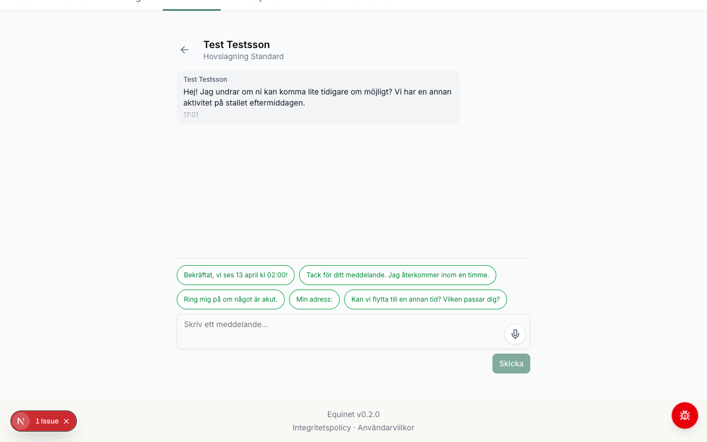
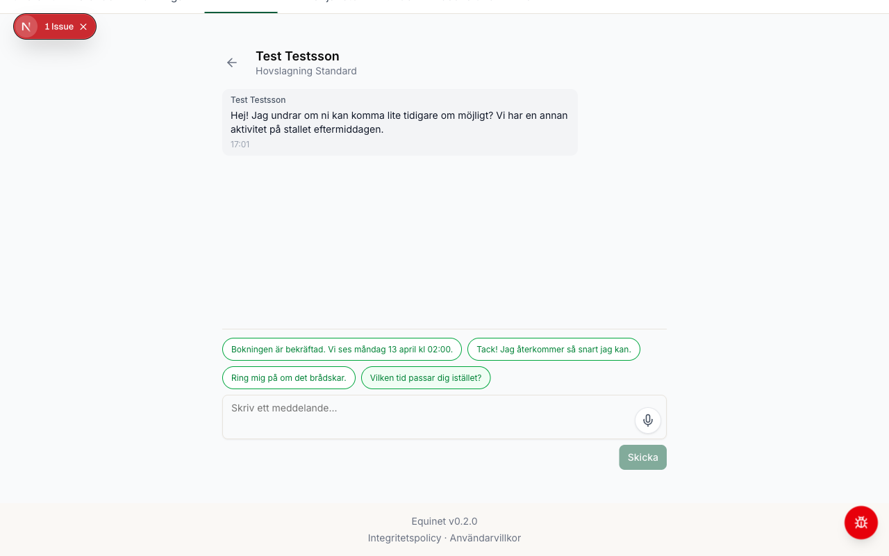
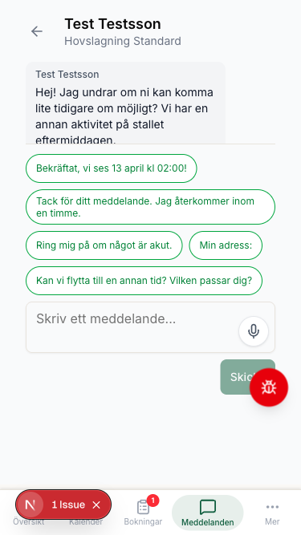
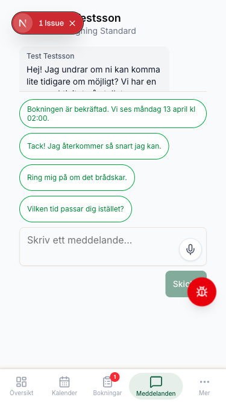

# Smart Replies UX Review

**Sprint**: S40 -- Smart-replies prod-ifiering
**Datum**: 2026-04-19
**Story**: S40-3 (cx-ux-reviewer before/after-jämförelse)

---

## Before/After-bilder

### Desktop (1280×800)

**Före** (hackathon-version, 5 chips):

**Efter** (S40-polerad, 4 chips, korrekta textsträngar):

### Mobil (375×667)

**Före** (hackathon-version, 5 chips):

**Efter** (S40-polerad, 4 chips, 44px touch targets):

---

## cx-ux-reviewer utlåtande

**Bedömning**: Villkorligt godkänt

### Positiva fynd

- Touch targets uppfyller 44px-standarden på mobil (`min-h-[44px] sm:min-h-0`)
- Visuell design är konsekvent med resten av appen (grön border, rundade knappar)
- Chip-texterna är korta och handlingsorienterade
- Placering ovanför inmatningsfältet är ergonomisk och förväntad
- `aria-label` med full chip-text är korrekt implementerat
- `role="group"` med `aria-label="Snabbsvar"` ger korrekt skärmläsarkontext
- `animate-in fade-in` ger behaglig introduktion

### Fynd som åtgärdades

1. **"Tack!" → "Tack,"** (fixad)
   - Utropstecken gör tonen för informell och ivrig för en professionell leverantör
   - Komma ger naturlig satsmelodi: "Tack, jag återkommer..."

2. **"Ring mig på {telefon}" -- behållen som-är**
   - cx-ux-reviewer flaggade fras som potentiellt kantig
   - Beslut: grammatiskt korrekt när telefonnummer är infyllt, ingen ändring

### Inga fynd att följa upp

Alla fynd hanterades antingen direkt eller avskrevs med motivering.

---

## Beslut och åtgärder

| Fynd | Åtgärd | Status |
|------|--------|--------|
| "Tack!" → "Tack," | Fixad i SmartReplyChips.tsx + test | Klar |
| "Ring mig på" | Behållen -- grammatiskt korrekt | Avskriven |

---

## Rollout-readiness

**Beslut: Godkänt för rollout**

Villkor uppfyllda:
- [x] Alla 4 templates är korrekta och naturliga svenska fraser
- [x] Touch targets uppfyller 44px-standard
- [x] Feature flag `smart_replies` (`defaultEnabled: false`) -- kontrollerad rollout möjlig
- [x] Hjälpartikel uppdaterad (`meddelanden.md`)
- [x] Testing-guide uppdaterad
- [x] Unit-tester täcker `expandTemplate` (7 tester)
- [x] cx-ux-reviewer godkänd

**Nästa steg**: Sätt `defaultEnabled: true` i `feature-flag-definitions.ts` när leverantörer ska börja se funktionen. Kommunicera via in-app-banner eller release notes.
