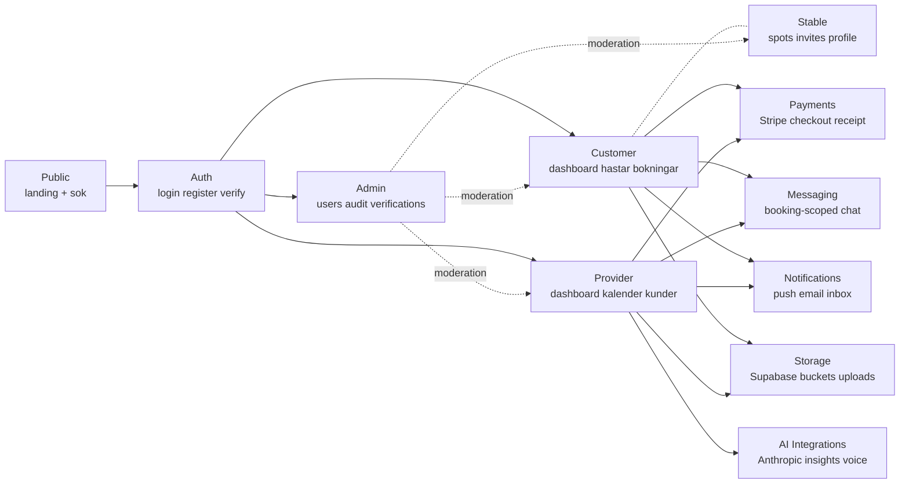
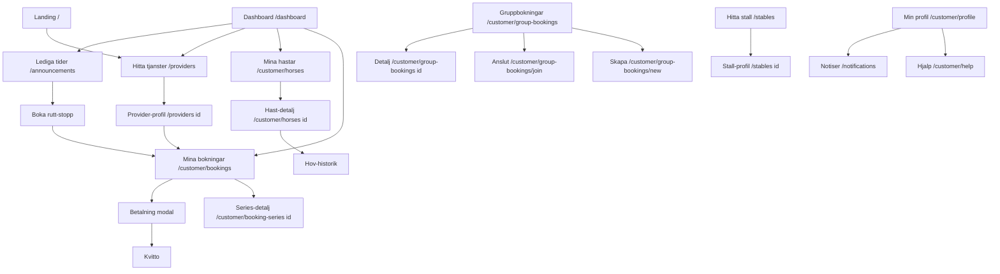
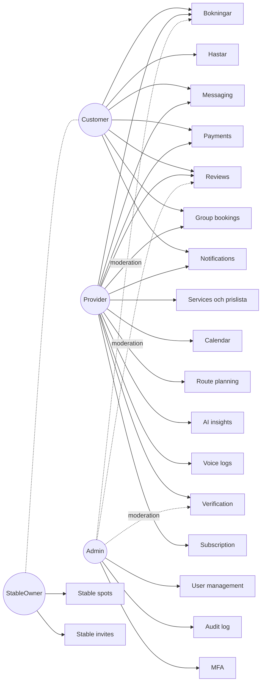
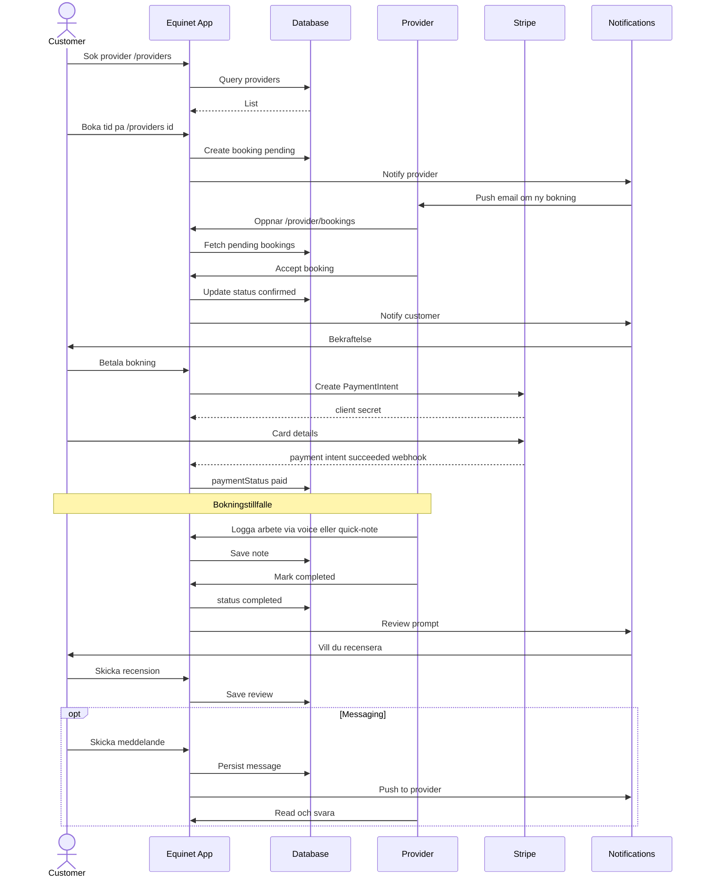
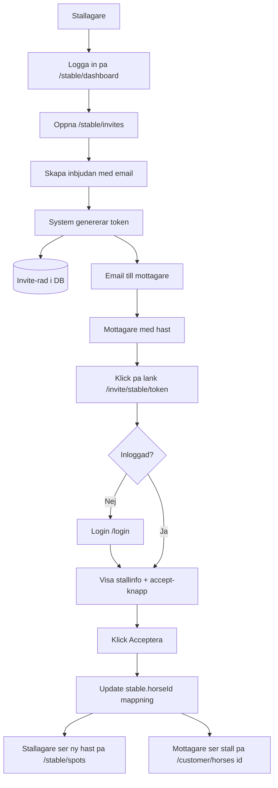

# Equinet Mermaid Diagram Library

Sju diagram avsedda för olika ändamål — stakeholder-presentation, UX-workshop, roadmap, demo-planering. Varje diagram är ett separat copy-paste-block. Miro-kompatibel syntax: plain-text-labels, inga special chars i nod-IDs, undviker nested subgraphs.

> **Källa:** Genererade från [`equinet-system-map-2026-05.md`](equinet-system-map-2026-05.md) per 2026-05-19. Uppdatera när nav-struktur, roller eller feature-flag-tillstånd ändras.

---

## 1. High-Level System Map

**Format:** `flowchart LR`
**Användning:** Stakeholder-presentationer, onboarding av nya utvecklare/PMs.

---

## 2. Customer Navigation Flow

**Format:** `flowchart TD`
**Användning:** UX-workshop, customer onboarding-analys, hitta "gömda" customer-features.

---

## 3. Provider Navigation Flow

**Format:** `flowchart TD`
**Användning:** UX-workshop (#1-prioritet eftersom provider-nav har 15 rader = högst kognitiv belastning), nav-reorganisations-diskussion.

```mermaid
flowchart TD
    Dashboard[Oversikt /provider/dashboard]

    Top[TOP NAV]
    Top --> Calendar[Kalender /provider/calendar]
    Top --> Bookings[Bokningar /provider/bookings]
    Top --> Messages[Meddelanden /provider/messages]

    Daily[DAGLIGT ARBETE]
    Daily --> Services[Mina tjanster /provider/services]
    Daily --> VoiceLog[Logga arbete /provider/voice-log]
    Daily --> Customers[Kunder /provider/customers]

    Planning[PLANERING]
    Planning --> RoutePlanning[Ruttplanering /provider/route-planning]
    Planning --> RouteDetail[Rutt-detalj /provider/routes id]
    Planning --> AnnouncementsList[Rutt-annonser /provider/announcements]
    Planning --> AnnouncementNew[Skapa annons /provider/announcements/new]
    Planning --> DueForService[Besoksplanering /provider/due-for-service]
    Planning --> GroupBookings[Gruppbokningar /provider/group-bookings]

    Business[MITT FORETAG]
    Business --> Insights[Insikter /provider/insights]
    Business --> Reviews[Recensioner /provider/reviews]
    Business --> Help[Hjalp /provider/help]
    Business --> Profile[Min profil /provider/profile]

    Hidden[Out-of-nav]
    Hidden --> Verification[Verifiering /provider/verification]
    Hidden --> Integrations[Integrationer /provider/settings/integrations]
    Hidden --> HorseTimeline[Hov-historik /provider/horse-timeline horseId]
    Hidden --> Export[Export /provider/export]
    Hidden --> Debug[Debug /provider/debug demo-only]

    Dashboard --> Top
    Dashboard --> Daily
    Dashboard --> Planning
    Dashboard --> Business

    Profile --> Verification
    Profile --> Integrations
    Profile --> Export
    Messages --> MessagesDetail[Konversation /provider/messages bookingId]
    AnnouncementsList --> AnnouncementDetail[Annons-detalj /provider/announcements id]
    GroupBookings --> GroupDetail[Gruppbokning-detalj]
    Customers --> CustomerDetail[Kund-detalj med Customer Insight]
    CustomerDetail --> HorseTimeline
```

---

## 4. Role Access Matrix

**Format:** `flowchart LR`
**Användning:** Sprint planning (är featuren cross-role?), onboarding, säkerhetsanalys av roll-separation.

---

## 5. Core Booking Flow

**Format:** `sequenceDiagram`
**Användning:** Säkerhets-/threat-modeling (C1-C4-fixar sitter på trust-gränserna), support-/CS-träning, demo-flöde.

---

## 6. Stable Invite Flow

**Format:** `flowchart TD`
**Användning:** Customer Success-träning, identifiera friktion i invite-flödet.

---

## 7. Feature Flag Landscape

**Format:** `flowchart TD`
**Användning:** Roadmap-visualisering, demo-planering (vilka routes som DEMO-blockerar), produktmognadsöversikt.

```mermaid
flowchart TD
    Production[PRODUCTION DEFAULT-ON]
    Production --> P1[Bookings]
    Production --> P2[Reviews]
    Production --> P3[Stripe payments]
    Production --> P4[Customer horses]
    Production --> P5[Provider services]
    Production --> P6[Calendar]

    Flagged[FEATURE-FLAGGED]
    Flagged --> F1[messaging - Customer messaging asymmetri]
    Flagged --> F2[voice_logging - Provider voice notes]
    Flagged --> F3[route_planning - Provider routes]
    Flagged --> F4[route_announcements - Public rutt-annonser]
    Flagged --> F5[help_center - Help articles]
    Flagged --> F6[customer_insights - AI customer summary]
    Flagged --> F7[business_insights - Provider analytics]
    Flagged --> F8[group_bookings - GA 2026-04]
    Flagged --> F9[recurring_bookings - GA 2026-04]
    Flagged --> F10[due_for_service - GA 2026-04]
    Flagged --> F11[self_reschedule - GA 2026-04]
    Flagged --> F12[follow_provider]
    Flagged --> F13[municipality_watch]
    Flagged --> F14[stable_profiles]
    Flagged --> F15[stripe_subscriptions]
    Flagged --> F16[customer_invite]
    Flagged --> F17[offline_mode]
    Flagged --> F18[push_notifications]

    DemoBlocked[DEMO-ONLY BLOCKED]
    DemoBlocked --> D1[Voice log redirect till profile]
    DemoBlocked --> D2[Announcements redirect]
    DemoBlocked --> D3[Route planning redirect]
    DemoBlocked --> D4[Due-for-service redirect]
    DemoBlocked --> D5[Group bookings redirect]
    DemoBlocked --> D6[Email outbound DEMO_EMAIL_BLOCKED]
    DemoBlocked --> D7[Push delivery DEMO_PUSH_BLOCKED]
    DemoBlocked --> D8[Customer delete DEMO_DELETE_BLOCKED]

    AIBacked[AI-BACKED Anthropic]
    AIBacked --> A1[Customer Insight summary]
    AIBacked --> A2[Voice interpretation]
    AIBacked --> A3[Quick-note structuring]

    Infra[INFRA SKYDD]
    Infra --> I1[assertSeedSafe prod-guard]
    Infra --> I2[Pre-commit secret-scan]
    Infra --> I3[Sprint 3-A C1-C4 fixes live]
    Infra --> I4[3A.fu.1-6 follow-up live]
```

---

## Användningsrekommendationer

| Användning | Bästa diagram | Varför |
|-------------|----------------|--------|
| **Stakeholder map** (investerare, partners, beslutsfattare) | #1 High-Level System Map | Visar produkten holistiskt utan tekniska detaljer. 9 noder, läsbart på en bildskärm |
| **UX workshop** (designers + product, problem-discovery) | #3 Provider Navigation Flow + #2 Customer Navigation Flow | Avslöjar nav-komplexitet (15 rader för provider) och "gömda" features |
| **Onboarding board** (nya utvecklare/PMs) | #1 + #4 Role Access Matrix | #1 ger orientering, #4 ger åtkomst-mental-modell |
| **Roadmap visualization** | #7 Feature Flag Landscape | Direkt mappning till GA-status: vad är prod-säkert, vad väntar på release, vad är AI-experimentellt |
| **Demo-planering** (Erik Järnfot-rundtur) | #7 + #3 | #7 visar vilka routes som DEMO-blockerar, #3 visar var de sitter i navigeringen |
| **Säkerhets-/threat-modeling** | #5 Core Booking Flow | Sequence-diagram synliggör trust-gränser där C1-C4-fixarna sitter |
| **Sprint planning** (nytt scope) | #4 Role Access Matrix | Avslöjar snabbt om en feature är cross-role eller single-role |
| **Support-/CS-träning** | #5 + #6 Stable Invite Flow | Konkreta flows som CS-team möter dagligen |

### Praktiska Miro-tips

- **Färgkoda** noderna efter roll i Miro efter import. Klistra in svartvitt först, måla sedan.
- **Splitta #3 (Provider) i flera Miro-frames** om den blir för stor — exempelvis en frame per sektion (Top/Dagligt/Planering/Mitt företag).
- **Diagram #7** är "platt" med avsikt — om du har Miro Pro kan grupper konverteras till verkliga zoner med swimlanes.
- Mermaid versionsskillnader: Miro stödjer normalt Mermaid 10.x. Diagrammet #5 (sequenceDiagram) använder bara baseline-syntax som är stabilt.

### Versionering

Uppdatera detta dokument när:

- Nav-struktur ändras (lägg/ta bort menyrader)
- Ny roll införs eller befintlig roll utökas
- Ny feature flag tillkommer eller GA-status ändras
- Större user-flows förändras

Hänvisa till [`equinet-system-map-2026-05.md`](equinet-system-map-2026-05.md) för full kontext bakom varje diagram.
