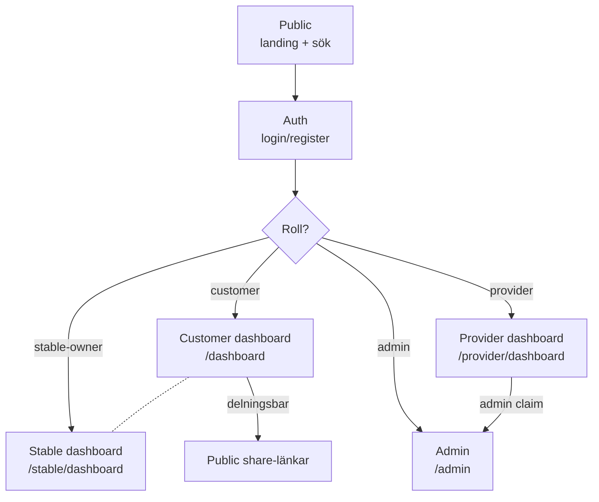

## Översikt och high-level app map

Equinet är en bokningsplattform för hästtjänster (hovslagare, veterinär, ridlärare, m.fl.) med fem distinkta användarperspektiv:

| Perspektiv | URL-segment | Primär persona | Login krävs |
|------------|-------------|----------------|-------------|
| **Public** | `/`, `/providers`, `/stables`, `/announcements` | Besökare som söker tjänster | Nej |
| **Auth** | `/(auth)/*` | Användare i registrering / login-flöde | Nej (av design) |
| **Customer** | `/dashboard`, `/customer/*`, `/notifications` | Kund som äger häst(ar) | Ja, role=customer |
| **Provider** | `/provider/*` | Tjänsteleverantör (hovslagare etc.) | Ja, providerId i JWT |
| **Stable** | `/stable/*`, `/stables/*` | Stallägare (sub-roll utöver kund) | Ja, isStableOwner |
| **Admin** | `/admin/*` | Plattform-admin | Ja, isAdmin claim |

Tre orthogonal-segment som inte är roll-specifika:
- **Native/iOS** — egna API-routes under `/api/native/*`, men UI:t använder samma `/customer/*`-pages via WKWebView eller native SwiftUI
- **Public shares** — `/profile/[token]`, `/invite/stable/[token]` (delningsbara länkar)
- **Legal** — `/anvandarvillkor`, `/integritetspolicy`



---

## Route inventory

### Public (ingen login krävs, 8 sidor)

| Route | Sida | Syfte |
|-------|------|-------|
| `/` | Landing | Marknadsföring, CTAs till register/login |
| `/providers` | Provider-sök | Lista och filtrera leverantörer |
| `/providers/[id]` | Provider-profil | Boka direkt, läs recensioner |
| `/stables` | Stall-sök | Lista stall |
| `/stables/[stableId]` | Stall-profil | Stall-info, kontakt |
| `/announcements` | Lediga rutt-tider | Provider-annonserade rutt-stopp |
| `/announcements/[id]/book` | Boka från annons | Convert announcement → booking |
| `/profile/[token]` | Delningsbar kund-/häst-profil | QR/länk-delning (publik read-only vy) |

### Auth (`(auth)`-route group, 8 sidor)

| Route | Sida | Notering |
|-------|------|----------|
| `/login` | Inloggning | Default start för iOS-app |
| `/register` | Registrering | Provider eller customer |
| `/forgot-password` | Glömt lösenord | Initierar reset-flöde |
| `/reset-password` | Sätt nytt lösenord | Klickas från email-länk |
| `/verify-email` | Verifiera e-post | Klickas från email-länk |
| `/resend-verification` | Skicka om verifieringsmail | För ej-verifierade konton |
| `/check-email` | "Kolla din e-post" | Övergångssida efter signup |
| `/accept-invite` | Acceptera kund-inbjudan | Provider bjuder in befintlig kund |

### Customer-vy (12 sidor)

| Route | Sida | Anteckning |
|-------|------|------------|
| `/dashboard` | Kund-dashboard | Översikt: kommande bokningar, hästar |
| `/customer/bookings` | Mina bokningar | Lista + status-filter |
| `/customer/booking-series/[id]` | Detalj för återkommande serie | Hantera kommande tillfällen |
| `/customer/horses` | Mina hästar | Lista |
| `/customer/horses/[id]` | Häst-detalj | Profil, hov-historik, due-for-service |
| `/customer/group-bookings` | Mina gruppbokningar | Skapade/anslutna |
| `/customer/group-bookings/new` | Skapa gruppbokning | Bjud in andra kunder |
| `/customer/group-bookings/join` | Anslut till gruppbokning | Via inbjudningslänk |
| `/customer/group-bookings/[id]` | Gruppbokning-detalj | Deltagare, matchning |
| `/customer/profile` | Min profil | Personuppgifter, hästar, inställningar |
| `/customer/faq` | FAQ | Statisk hjälp |
| `/customer/help`, `/customer/help/[slug]` | Hjälpcenter | Artiklar (feature-flaggad) |
| `/notifications` | Notifikationer | Inkorg för push/email-notiser |
| `/invite/stable/[token]` | Acceptera stall-inbjudan | Stallägare bjuder in häst |

### Provider-vy (20 sidor)

**Daglig drift:**
| Route | Sida |
|-------|------|
| `/provider/dashboard` | Översikt — KPIs + dagens schema |
| `/provider/calendar` | Kalender — vecko-/dagvy |
| `/provider/bookings` | Bokningslista |
| `/provider/messages` | Konversations-inkorg |
| `/provider/messages/[bookingId]` | Konversation per bokning |
| `/provider/services` | Mina tjänster — pris/duration |
| `/provider/voice-log` | Logga arbete via röst |
| `/provider/customers` | Kundlista + manuell skapelse |

**Planering:**
| Route | Sida |
|-------|------|
| `/provider/route-planning` | Rutt-planering |
| `/provider/routes/[id]` | Rutt-detalj |
| `/provider/announcements` | Mina rutt-annonser |
| `/provider/announcements/new` | Skapa annons |
| `/provider/announcements/[id]` | Annons-detalj |
| `/provider/due-for-service` | Besöksplanering — kunder som närmar sig nästa hovslag |
| `/provider/group-bookings`, `/provider/group-bookings/[id]` | Mina gruppbokningar |

**Mitt företag:**
| Route | Sida |
|-------|------|
| `/provider/insights` | Affärsdata, heatmaps, intäkter |
| `/provider/reviews` | Mina recensioner + svar |
| `/provider/help`, `/provider/help/[slug]` | Hjälpcenter |
| `/provider/profile` | Mina uppgifter, inställningar |

**Andra:**
| Route | Sida |
|-------|------|
| `/provider/verification` | Verifierings-ansökan (med uploads) |
| `/provider/settings/integrations` | Fortnox, Stripe, kalender-sync |
| `/provider/horse-timeline/[horseId]` | Hov-historik för specifik häst |
| `/provider/export` | Datauttag (GDPR) |
| `/provider/debug` | Debug-vy (DEMO_MODE-gated) |

### Stable-vy (4 sidor — sub-roll, hostas från kund-konto)

| Route | Sida |
|-------|------|
| `/stable/dashboard` | Stall-översikt |
| `/stable/spots` | Stallplatser |
| `/stable/invites` | Skickade inbjudningar |
| `/stable/profile` | Stall-information |

### Admin-vy (15 sidor)

| Route | Sida |
|-------|------|
| `/admin` | Översikt |
| `/admin/users` | Användarhantering |
| `/admin/bookings` | Alla bokningar |
| `/admin/reviews` | Recensionsmoderering |
| `/admin/verifications` | Verifieringsansökningar |
| `/admin/bug-reports`, `/admin/bug-reports/[id]` | Buggrapporter |
| `/admin/integrations` | Externa system-status |
| `/admin/system` | System-status |
| `/admin/audit-log` | Audit log |
| `/admin/notifications` | Notifikationer-debugging |
| `/admin/testing-guide` | Intern testningsguide |
| `/admin/help`, `/admin/help/[slug]` | Hjälpcenter (admin-vinkel) |
| `/admin/mfa/setup`, `/admin/mfa/verify` | MFA-flöden |

### Övriga publika sidor

| Route | Sida |
|-------|------|
| `/anvandarvillkor` | Användarvillkor |
| `/integritetspolicy` | Integritetspolicy |
| `/~offline` | Offline-fallback (Service Worker) |

**Totalt: ~80 sidor** över alla roller.

---

## Navigation tree

### Customer-nav (huvudmenu)

```
Customer (CustomerNav.tsx + Header)
├── Hitta tjänster      → /providers
├── Mina bokningar      → /customer/bookings
├── Lediga tider        → /announcements
├── Gruppbokningar      → /customer/group-bookings
├── Mina hästar         → /customer/horses
├── Hjälp               → /customer/help          (flag: help_center)
├── Min profil          → /customer/profile
├── Hitta stall         → /stables               (sektion: Stall)
├── Mitt stall          → /stable/dashboard      (om isStableOwner)
└── Admin               → /admin/verifications   (om isAdmin)
```

**BottomTabBar (mobil):** Bokningar, Hästar, Lediga tider, Gruppbokningar, Sök (`/providers`).

### Provider-nav (huvudmenu, sektionerad)

```
Provider (ProviderNav.tsx)
├── [top]
│   ├── Översikt        → /provider/dashboard          (offline-safe)
│   ├── Kalender        → /provider/calendar           (offline-safe)
│   ├── Bokningar       → /provider/bookings           (offline-safe)
│   └── Meddelanden     → /provider/messages           (flag: messaging)
├── Dagligt arbete
│   ├── Mina tjänster   → /provider/services
│   ├── Logga arbete    → /provider/voice-log          (flag: voice_logging)
│   └── Kunder          → /provider/customers
├── Planering
│   ├── Ruttplanering   → /provider/route-planning     (flag: route_planning)
│   ├── Rutt-annonser   → /provider/announcements      (flag: route_announcements)
│   ├── Besöksplanering → /provider/due-for-service
│   └── Gruppbokningar  → /provider/group-bookings
└── Mitt företag
    ├── Insikter        → /provider/insights
    ├── Recensioner     → /provider/reviews
    ├── Hjälp           → /provider/help               (flag: help_center)
    └── Min profil      → /provider/profile
```

**BottomTabBar (mobil, 5 slots):** Översikt, Kalender, Bokningar, Kunder, Meddelanden ELLER Insikter (beror på flag-state).

### Admin-nav

```
Admin (AdminNav.tsx)
├── Översikt            → /admin
├── Användare           → /admin/users
├── Bokningar           → /admin/bookings
├── Recensioner         → /admin/reviews
├── Verifieringar       → /admin/verifications
├── Buggrapporter       → /admin/bug-reports
├── Integrationer       → /admin/integrations
├── System              → /admin/system
├── Audit Log           → /admin/audit-log
├── Notifikationer      → /admin/notifications
├── Testningsguide      → /admin/testing-guide
└── Hjälp               → /admin/help
```

### Stable-nav

```
Stable (StableNav.tsx)
├── Översikt            → /stable/dashboard
├── Platser             → /stable/spots
├── Inbjudningar        → /stable/invites
└── Stallprofil         → /stable/profile
```

### Header (cross-cutting)

- `/` (logo → landing)
- `/login`, `/register` (när utloggad)
- Dashboard-länk (`/provider/dashboard` om provider, annars `/dashboard`)
- Profil-länk (`/provider/profile` / `/customer/profile`)
- `/stable/profile` (om stable-ägare)
- `/admin` (om admin)
- "Byt vy"-shortcut (om både provider och customer-roll finns)

### Cross-role-shortcuts

CustomerNav inkluderar **"Byt vy"-sektion** med snabba växlingar mellan Provider-vy / Kund-vy / Admin. Detta tyder på att en användare kan ha flera roller samtidigt (provider OCH customer, eller customer + admin).

---

## Feature clusters

### 1. Bokningar (kärndomän)

**UI-sidor:**
- Customer: `/customer/bookings`, `/customer/booking-series/[id]`
- Provider: `/provider/bookings`, `/provider/calendar` (visuell), `/provider/dashboard` (KPI)
- Public: `/announcements/[id]/book`
- Admin: `/admin/bookings`

**Funktioner:**
- Enskilda bokningar (status: pending, confirmed, completed, cancelled, no_show)
- Återkommande serier (`BookingSeries`)
- Bokningsförfrågningar från publika annonser
- Reschedule-flöde (provider-konfigurerat)

**Anslutna features:** Messaging, payments, reviews, due-for-service.

### 2. Hästar & häst-historik

**UI-sidor:**
- Customer: `/customer/horses`, `/customer/horses/[id]`
- Provider: `/provider/horse-timeline/[horseId]`
- Public: `/profile/[token]` (delningsbar)

**Funktioner:**
- Häst-profiler (namn, ras, hovinformation)
- Hovslagar-intervall + nästa förfallodag
- Tidslinje över historiska besök
- QR/delningsbar profil för stallpersonal

### 3. Messaging (meddelanden mellan kund och provider)

**UI-sidor:**
- Provider: `/provider/messages`, `/provider/messages/[bookingId]`
- Customer: tillgång via bokningsdetalj-vyer (inte separat top-level)

**Funktioner:**
- Konversation per bokning (1:1)
- Bilage-uppladdning (privata bucket, signed URLs)
- Unread-count i navigation

**Notering:** Feature-flaggad (`messaging`). Customer har INGEN separat top-level message-inkorg — bara kontextuell tillgång från bokningar.

### 4. Payments

**UI-sidor:** Mestadels modal-baserat i `/customer/bookings`. Ingen separat top-level payment-sida.

**Funktioner:**
- Stripe PaymentIntent per bokning
- Receipt-generering
- Provider-prenumeration (Stripe subscription)

### 5. Subscriptions (provider-prenumeration)

**UI-sidor:**
- `/provider/profile` — startpunkt för Stripe checkout/portal

**Funktioner:**
- 3 tiers (basic/premium/etc.)
- Feature-gating per tier

### 6. Route planning (provider)

**UI-sidor:**
- `/provider/route-planning`, `/provider/routes/[id]`
- `/provider/announcements`, `/provider/announcements/new`, `/provider/announcements/[id]`

**Funktioner:**
- Rutt-skapande för dagsbesök
- Publika annonseringar (kunder kan boka rutt-stopp)
- TravelTime-service (Google Maps integration)

### 7. AI Insights & Customer Insights

**UI-sidor:**
- `/provider/insights` — heatmaps, intäktstrender
- `/provider/customers` — kund-detalj kan visa Customer Insight (AI-genererad summering)

**Funktioner:**
- Business Insights (intäkter, kundvärdet, heatmaps)
- AI-genererade kund-summeringar (Anthropic API)

### 8. Voice logs

**UI-sidor:**
- `/provider/voice-log` — provider talar in arbets-noter

**Funktioner:**
- Speech-to-text (iOS native eller webb)
- AI-tolkning till strukturerade fält (Anthropic)
- Quick-notes per bokning

### 9. Uploads & verifications

**UI-sidor:**
- `/provider/verification` — ladda upp ID/cert
- `/customer/horses/[id]` — häst-foton
- `/provider/profile` — profil-bild
- `/provider/services` — service-bilder

**Funktioner:**
- 4 storage-buckets (avatars, horses, services, verifications)
- + privat message-attachments

### 10. Stable management

**UI-sidor:** Hela `/stable/*` + `/invite/stable/[token]`

**Funktioner:**
- Stallplatser (spots)
- Bjuda in hästar/kunder
- Stallprofil (publik via `/stables/[stableId]`)

### 11. Group bookings

**UI-sidor:**
- Customer: `/customer/group-bookings/{,new,join,[id]}`
- Provider: `/provider/group-bookings`, `/provider/group-bookings/[id]`

**Funktioner:**
- En kund initierar, andra kunder ansluter
- Provider matchar erbjudande mot grupp
- Pris-/tid-koordinering

### 12. Notifications

**UI-sidor:**
- `/notifications` (customer)
- Admin: `/admin/notifications` (debug)

**Funktioner:**
- Inkorg för push + email-notiser
- Realtid via webhook + scheduled jobs

### 13. Due-for-service & Municipality-watch

**UI-sidor:**
- `/provider/due-for-service` — kunder som närmar sig nästa hovslag
- `/customer/horses/[id]` — kund ser eget intervall

**Funktioner:**
- Algoritmisk beräkning av nästa servicedatum baserat på interval
- Optional municipality-watch (övervaka kommun-skifte för rutt-annonser)

### 14. Admin operations

**UI-sidor:** Hela `/admin/*`

**Funktioner:**
- Användarhantering, moderering, audit log
- MFA-setup för admin-konton
- System-health, integrations-status

---

## Roll- och åtkomstmatris

| Sida-cluster | Anonym | Customer | Provider | Stable-ägare | Admin |
|--------------|:------:|:--------:|:--------:|:------------:|:-----:|
| Landing (`/`) | ✅ | ✅ | ✅ | ✅ | ✅ |
| Provider-sök (`/providers`) | ✅ | ✅ | ✅ | ✅ | ✅ |
| Stall-sök (`/stables`) | ✅ | ✅ | ✅ | ✅ | ✅ |
| Auth-flöden (`/(auth)`) | ✅ | – | – | – | – |
| Customer-dashboard (`/dashboard`) | redirect→login | ✅ | – | ✅ | ✅ |
| Customer-vyer (`/customer/*`) | redirect→login | ✅ | – | ✅ | ✅ |
| Provider-vyer (`/provider/*`) | redirect→login | – | ✅ | – | ✅ |
| Stable-vyer (`/stable/*`) | redirect→login | – | – | ✅ | ✅ |
| Admin-vyer (`/admin/*`) | redirect→login | – | – | – | ✅ (RSC guard) |
| Notifications (`/notifications`) | redirect→login | ✅ | ✅ | ✅ | ✅ |
| Delningsbara profiler (`/profile/[token]`) | ✅ | ✅ | ✅ | ✅ | ✅ |
| Legal (`/anvandarvillkor`, `/integritetspolicy`) | ✅ | ✅ | ✅ | ✅ | ✅ |

**Cross-role:**
- En användare kan ha **customer + provider + admin** roller samtidigt (CustomerNav stödjer "Byt vy"-shortcut)
- **Stable-ägare** är en sub-roll av customer (man har ett kundkonto + stall-koppling)
- **Admin** är en separat claim oavsett primär roll

---

## Core user flows

### Flow 1 — Kund bokar en tjänst

```
/                            (landing, CTA)
  → /providers               (sök leverantörer)
    → /providers/[id]        (provider-profil + boknings-modal)
      → (om utloggad) /register eller /login
      → /customer/bookings   (bekräftelse + bokning visas)
        → (efter slutförd bokning) review-modal → recension
```

### Flow 2 — Provider tar emot bokning

```
/provider/dashboard          (notis om ny bokning)
  → /provider/bookings       (lista + filter pending)
    → bokningsdetalj         (modal eller kort)
      → accept/decline       (bekräfta + skickar bokningsbekräftelse)
        → (efter besök) markera completed
          → (om msg-feature) /provider/messages/[bookingId]
```

### Flow 3 — Provider onboarding

```
/                            (landing)
  → /register                (välj "Leverantör")
    → /check-email           (verifiera email)
      → /verify-email        (klick från email)
        → /provider/dashboard
          → /provider/profile      (fyll i tjänster, geografi)
            → /provider/services   (skapa pristabeller)
              → /provider/verification  (ladda upp ID/cert)
                → admin granskar → /admin/verifications
                  → status uppdateras → provider verifierad
```

### Flow 4 — Customer onboarding

```
/                            (landing)
  → /register                (välj "Kund")
    → /check-email
      → /verify-email
        → /dashboard
          → /customer/horses         (lägg till första häst)
            → /customer/profile      (adress, kontaktuppgifter)
              → /providers           (hitta första leverantör)
```

### Flow 5 — Upload-flöde (häst-bild)

```
/customer/horses/[id]
  → klick på bild-uppladdning
    → file picker
      → POST /api/upload (bucket: horses)
        → validateFile + assertSafeStorageFileName + uploadFile
          → Supabase Storage (eller dev-fallback om NODE_ENV != production)
            → uppdaterar horse.photoUrl
              → bild visas direkt
```

### Flow 6 — Payment-flöde

```
/customer/bookings
  → klick "Betala" på bokning
    → modal med Stripe PaymentElement
      → submit → POST /api/bookings/[id]/payment
        → Stripe PaymentIntent
          → webhook: payment_intent.succeeded
            → booking.paymentStatus = paid
              → receipt tillgänglig: GET /api/bookings/[id]/receipt
```

### Flow 7 — Messaging-flöde

```
/provider/messages           (inkorg, sorterad efter aktivitet)
  → klick på konversation
    → /provider/messages/[bookingId]
      → skriv meddelande / ladda upp bilaga
        → POST /api/bookings/[id]/messages eller .../attachments
          → PUSH till andra parten
            → kund får notis (om push aktiv)
              → kund öppnar app → läser från bokningsdetalj
```

### Flow 8 — Stall-inbjudan-flöde

```
/stable/invites              (stallägare skapar inbjudan)
  → genererar token-länk
    → kund får email/SMS med /invite/stable/[token]
      → kund klickar
        → autentiserad? Ja → accept ↦ stall får ny häst
        → autentiserad? Nej → /login med return-URL
```

---

## UX-observationer och risker

### Navigationskomplexitet

| Observation | Bedömning |
|-------------|-----------|
| Provider-nav har **15 rader** i huvud-menyn (4 sektioner) | **HÖG kognitiv belastning**. Feature-flag-gating maskerar några för demo, men en aktiv provider med alla flaggor på får mycket att skanna |
| Customer-nav har **9-10 rader** + cross-role-shortcuts | OK men "Byt vy"-shortcut för users med flera roller är gömt — kan upptäckas slumpartat |
| Admin-nav har **12 rader** | OK för admins (verktyget-användare) men ingen sektionering |
| Stable-nav har **4 rader** | Lågt, tydligt scope |

### Otydliga eller "gömda" flöden

| Feature | Problem |
|---------|---------|
| **Customer messaging** | Ingen separat top-level "Meddelanden"-vy. Kund ser bara konversation via bokningsdetalj. Lätt att missa när det är feature-flaggat |
| **Customer notifications** | `/notifications`-route finns men ingen direkt nav-länk i CustomerNav. Klockikon i Header? Behöver verifieras |
| **Group bookings** | Kund kan både skapa OCH ansluta — separata flöden men under samma top-level. Kan vara förvirrande |
| **Stable management** | Stable-ägar-läget är "läge" man växlar till via "Mitt stall"-länk. Switching-affordance otydlig |
| **Customer bokning av rutt-annons** | Publik flow `/announcements/[id]/book` men ingen tydlig övergång från `/announcements` listan i customer-vy |
| **Provider-debug** | `/provider/debug` är osynlig utan demo-mode-flagga. Kanske medvetet, men inte dokumenterat för nya utvecklare |

### Duplicerade vägar

| Konvergerande vägar | Notering |
|---------------------|----------|
| Provider-profil nås via `/provider/profile` (egen) OCH `/providers/[id]` (publik vy) | Två separata pages-mappar. Skillnad i innehåll men risk för förvirring i kod-base |
| Stall-vy: `/stable/dashboard` (egen, drift) OCH `/stables/[stableId]` (publik) | Samma mönster |
| Messaging URL-konvention: `/provider/messages/[bookingId]` (provider) — kund saknar motsvarande dedikerad page | Asymmetri — provider har dedicerad inbox, kund inte |
| Help center: `/customer/help`, `/provider/help`, `/admin/help` — tre separata page-trees | Innehåll kan vara delvis duplicerat |

### Feature-flags som påverkar nav

Provider-nav döljer rader baserat på flags:
- `messaging` (Meddelanden)
- `voice_logging` (Logga arbete)
- `route_planning` (Ruttplanering)
- `route_announcements` (Rutt-annonser)
- `help_center` (Hjälp)

Konsekvens: provider med olika flag-states ser olika menyer. Detta är **avsiktligt** men gör UX-design tricky — vad är "baseline"-navigation utan flaggor?

### Demo-läge påverkar navigation

`isDemoModeWithFlags()` redirectar 5 provider-pages till `/provider/profile`:
- voice-log, announcements, route-planning, due-for-service, group-bookings

Dessa pages är **synliga i nav** men non-funktionella i demo. Konsistens-issue.

### Kandidater för UX-polish

1. **Provider-nav-konsolidering** — 15 rader är mycket. Kan "Mitt företag" foldas?
2. **Customer messaging-affordance** — top-level inkorg saknas
3. **Group bookings flow** — skapa vs ansluta bör tydliggöras
4. **Stable-mode switch** — gör cross-role-switching mer synlig
5. **Notifications-länk i CustomerNav** — saknas idag
6. **Feature-flag-medveten design** — basline-baserad navigation
7. **Public profile-share** (`/profile/[token]`) — gömd feature, kan exponeras mer

### Mer subtila observationer

- **Onboarding-friction**: Provider behöver klara `/provider/profile` → `/provider/services` → `/provider/verification` innan de är fullt funktionella. Ingen explicit progress-tracker idag.
- **Help center fragmenterad**: 3 separata help-trees (customer/provider/admin). En unified search-funktion saknas i UI.
- **Native vs webb**: iOS-app använder samma routes via WKWebView men har också native SwiftUI-skärmar. Användaren ser ibland native (snabb), ibland webb (långsammare). Inkonsistent UX-känsla.
- **Provider-only domain features**: Voice-logging, route-planning, due-for-service — saknar customer-motsvarigheter (vilket är OK, men gör product asymmetric).

---

## Rekommendationer för Figma/UX-arbete

### Föreslagen design-prioritering

| Slice | Beskrivning | Effort | Värde |
|-------|-------------|--------|-------|
| **F1** | Provider-nav reorganisation (folding av "Mitt företag", icon-konsekvens, mobile bottom-tab-strategi) | Hög | Hög — adresserar #1 friktion |
| **F2** | Customer messaging-inbox (top-level vy + nav-link) | Medel | Medel-hög |
| **F3** | Group bookings flow-städning (separera skapa/ansluta) | Medel | Medel |
| **F4** | Provider onboarding wizard (`profile → services → verification` med progress) | Hög | Hög för aktivering |
| **F5** | Notifications-bell i CustomerNav header | Låg | Medel |
| **F6** | Cross-role-switcher mer synlig (för users med multipla roller) | Låg | Låg-medel |
| **F7** | Help center unified search | Medel | Medel |
| **F8** | Demo-mode-state visuell tydlighet (banner/badge?) | Låg | Medel — bra för demo-presentationer |

### Föreslagen Figma-struktur

För att börja Figma-arbetet rekommenderas följande sidor i ordning:

1. **System Map** — replikera denna doc:s diagram visuellt i Figma som första sida
2. **Component inventory** — befintliga shadcn-komponenter mappade till Figma-komponenter
3. **Route × screens-grid** — varje sida som en frame, gruppera per roll
4. **User flows** — flödesdiagram för Flow 1-8 (i samma fil eller separat)
5. **Mobile bottom-nav explorations** — för provider-nav-reorganisationen (F1)
6. **Onboarding-wizard explorations** — för F4

Använd existing brand-färg `Color.equinetGreen` (definierad i iOS-koden men borde extraheras till en design-token-fil).

### Demo-planering

För att demonstrera plattformen utan att rodna, prioritera:

| Demo-roll | Bästa demovärde | Undvik att visa |
|-----------|------------------|-----------------|
| Provider (Erik Järnfot) | Calendar, voice-log, insights | Demo-blockerade routes (announcements, route-planning, due-for-service, group-bookings) — alla redirectas |
| Customer | Boka från `/providers`, mina hästar, gruppbokningar | Notifications-inkorg (saknar UI), customer messaging (asymmetrisk) |
| Stable-ägare | Stallprofil + invites | Spots-vyn (gränsmaterial) |
| Admin | Audit log, verifications, system | bug-reports (innehåller test-data) |

### Onboarding-doc-rekommendation

Lägg till en **"Vyer per roll"-cheat sheet** i `docs/operations/onboarding.md` (om existerar) eller skapa ny. Använd Route inventory-tabellerna från denna doc som källa.

---

## Bilaga: ASCII top-level app-karta

```
                    ┌──────────────────┐
                    │     Landing /    │
                    └────────┬─────────┘
                             │
        ┌────────────────────┼────────────────────┐
        │                    │                    │
   /providers           /stables            /announcements
    (publik)             (publik)             (publik)
        │                    │                    │
        └─────────────┬──────┴────────────────────┘
                      │
              ┌───────▼────────┐
              │ Login/Register │
              │  /(auth)/...   │
              └───────┬────────┘
                      │
        ┌─────────────┼─────────────┬──────────────┐
        │             │             │              │
   /dashboard   /provider/      /stable/        /admin
   (customer)   dashboard       dashboard      (admin)
        │             │             │              │
        │             │             │              │
   ┌────┴────┐   ┌────┴────┐   ┌───┴────┐    ┌────┴────┐
   │ horses  │   │ kalender│   │ spots  │    │ users   │
   │ bookings│   │ kunder  │   │ invites│    │ bookings│
   │ profile │   │ insights│   │ profile│    │ audit   │
   │ help    │   │ services│   └────────┘    │ system  │
   │ stall   │   │ profile │                 │ verif   │
   │ admin   │   │ ...     │                 └─────────┘
   └─────────┘   └─────────┘
```

---

**Status:** Denna doc är levande. Uppdatera vid varje större UX-ändring (nav-omorganisation, ny page, role-shifting).
